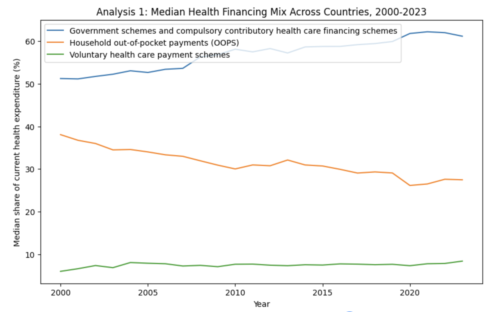
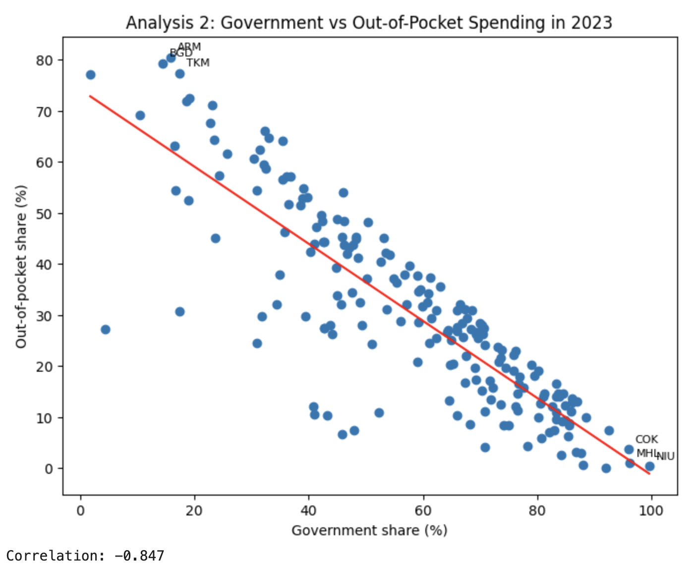
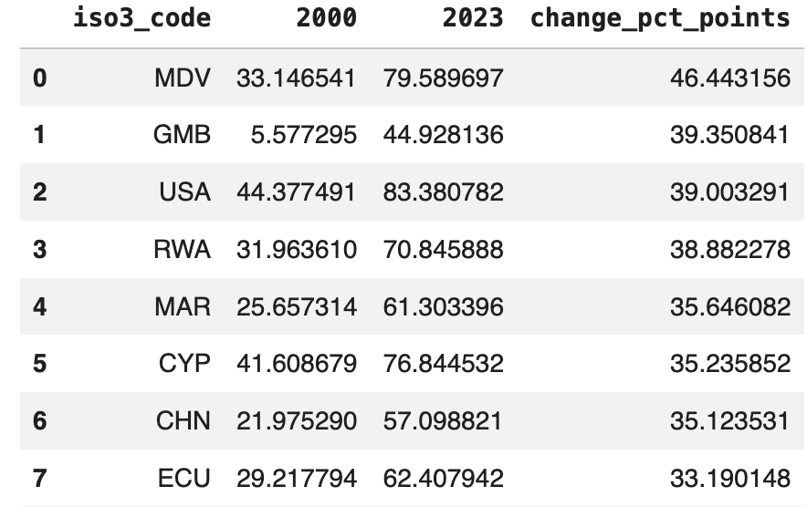
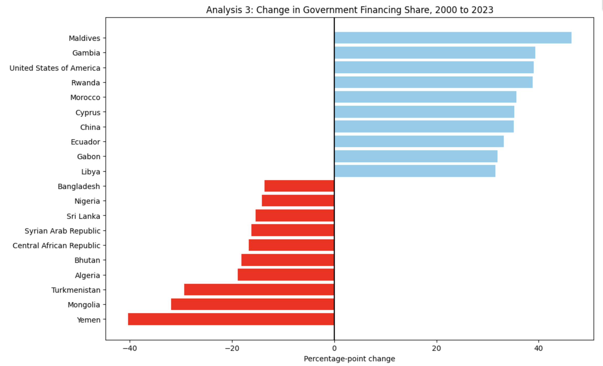
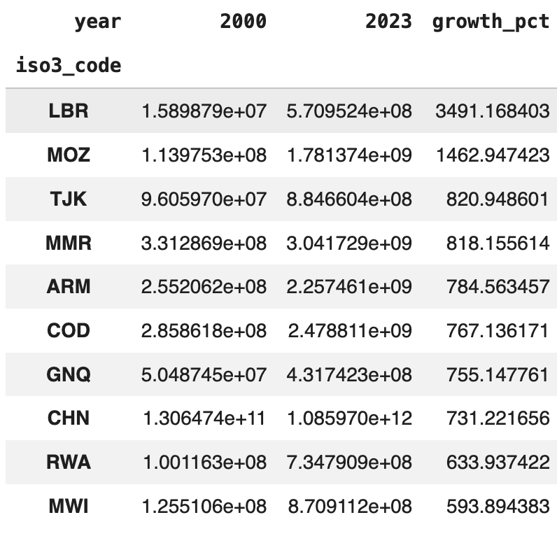
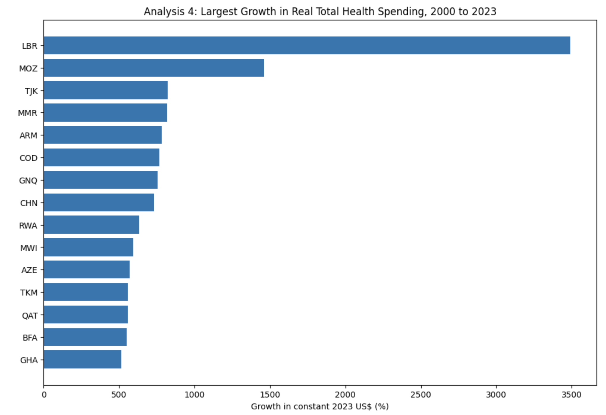
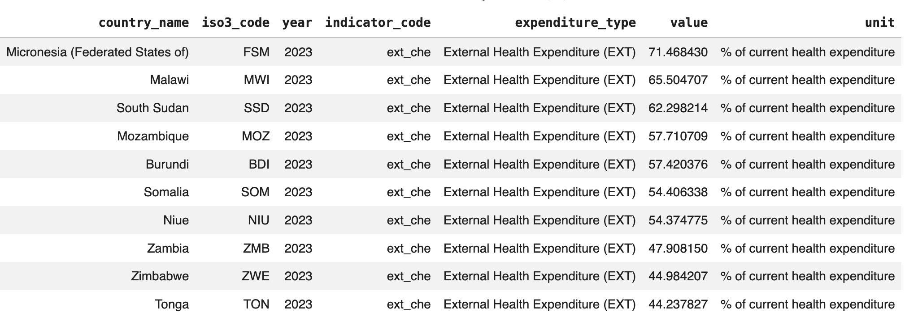
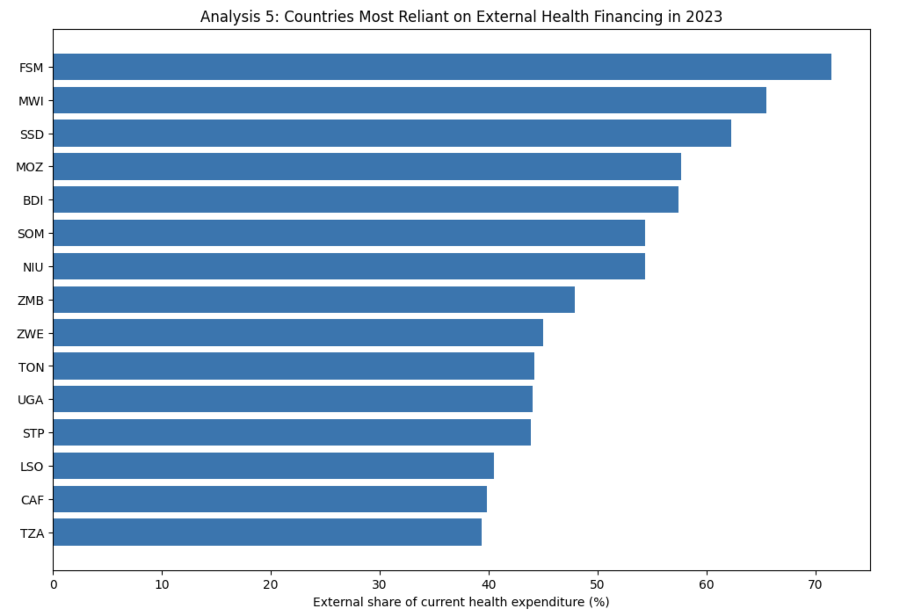
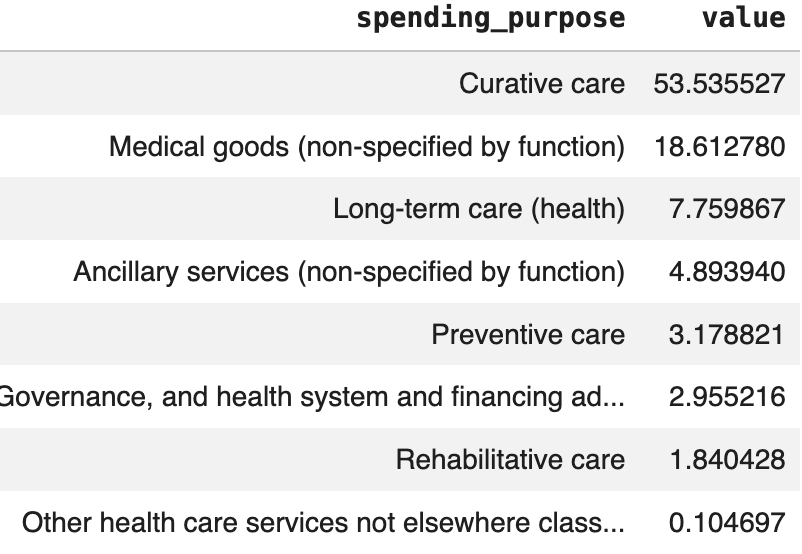
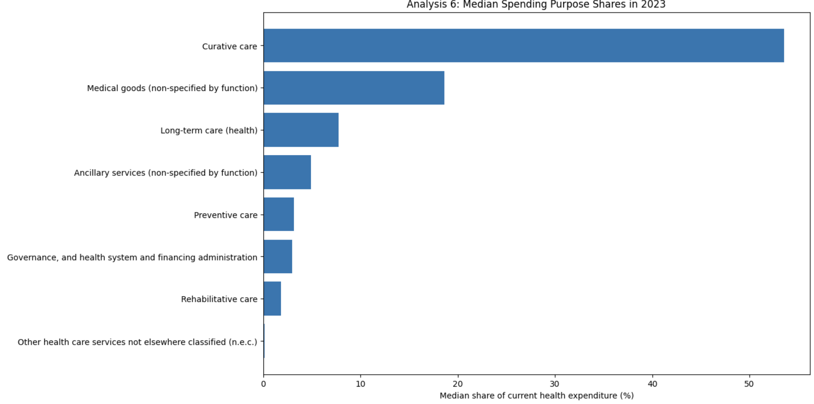

# Global Health Financing Analysis

I used a TidyTuesday dataset about global health financing to explore how countries pay for health care and how health spending changes across countries.

The project includes 6 analyses and a graph for each analysis.

## Research Goal

The goal of this project is to study global health financing patterns from 2000 to 2023.

I wanted to answer questions such as:

1. What are the main ways countries finance health care?
2. How has health financing changed over time?
3. What is the relationship between government spending and out-of-pocket spending?
4. Which countries had the biggest changes in government financing?
5. Which countries had the largest growth in health spending?
6. How is health spending divided across different purposes?

## Summary of the 6 Analyses

### Analysis 1

This analysis examines the median share of three major health financing sources across countries from 2000 to 2023. The three sources are government financing, household out-of-pocket payments, and voluntary health care payment schemes. The purpose of this analysis is to show which financing source is most dominant across countries and how the balance between these sources changes over time. 
This analysis shows that government financing was the dominant source of health financing across from 2000 to 2023. The median government share increased over time, rising from a little above 50% in 2000 to more than 60% by the end of the period. In contrast, the median share of household out-of-pocket payments decreased from around 38% to about 27% to 28%. Voluntary health care payment schemes stayed much lower than the other two sources and changed only slightly over time. Overall, the pattern suggests that many countries became more reliant on government financing and somewhat less reliant on direct household payments.

### Analysis 2

This analysis focuses on the relationship between government financing and out-of-pocket spending in 2023. I compared these two variables across countries to see whether countries with higher government financing tend to have lower household payment burdens. This analysis helps show whether stronger government support is linked to less direct spending by individuals.
This analysis found a strong negative relationship between government financing and out-of-pocket spending in 2023. The correlation was about -0.847, which means that countries with higher government financing shares usually had lower out-of-pocket shares. This suggests that stronger government support may reduce the financial burden placed directly on households. The scatterplot also shows that countries with very low government shares often had much higher out-of-pocket spending, while countries with very high government shares tended to have low household payment burdens.

### Analysis 3

This analysis measures how government financing changed between 2000 and 2023 in each country. I calculated the difference in government financing share over time and identified the countries with the largest increases and the largest decreases. This analysis helps show which health systems became more government-funded and which moved away from that pattern.
This analysis shows that changes in government financing differed greatly across countries between 2000 and 2023. Maldives had the largest increase in government financing share, followed by Gambia, the United States of America, Rwanda, and Morocco. On the other hand, Yemen showed the largest decline, followed by Mongolia, Turkmenistan, Algeria, and Bhutan. These results suggest that some countries moved toward stronger government financing of health care, while others became less government-funded over time. This analysis highlights that global health financing patterns did not change in the same way everywhere.

Top increases in government financing share:

Graph of the largest increases and decreases:

### Analysis 4

This analysis looks at the growth in total health spending in constant 2023 US dollars between 2000 and 2023. I compared countries to identify where health spending increased the most in real terms. This analysis is useful because it shows where major expansion in health expenditure took place over time.
This analysis shows that some countries experienced very large growth in real total health spending between 2000 and 2023. Liberia had the largest increase, followed by Mozambique, Tajikistan, Myanmar, and Armenia. Other countries such as the Democratic Republic of the Congo, Equatorial Guinea, China, and Rwanda also showed strong growth. These findings suggest that health expenditure expanded rapidly in some countries over time, although the scale of growth varied a lot from country to country. Overall, the analysis shows that real health spending increased substantially in a number of countries during this period.

Top countries with the largest growth in real health spending:

Graph of the countries with the largest growth:

### Analysis 5

This analysis identifies the countries that depended most heavily on external health financing in 2023. External health financing includes money that comes from outside the country, such as international aid or foreign support. The purpose of this analysis is to show which countries rely most on outside funding for their health systems.
This analysis found that several countries remained highly dependent on external health financing in 2023. Micronesia (Federated States of) had the highest external financing share at about 71.47%, followed by Malawi at about 65.50% and South Sudan at about 62.30%. Mozambique, Burundi, Somalia, and Niue also had very high shares. These results suggest that some health systems still rely heavily on outside funding, such as international aid or foreign support, rather than mainly domestic financing. This may indicate greater financial vulnerability if external support changes.

Top countries with the highest external health financing in 2023:

Graph of the countries most reliant on external health financing:

### Analysis 6

This analysis explores how health spending was distributed across different health purposes in 2023. I compared categories such as curative care, preventive care, long-term care, and medical goods. This analysis shows where health resources are mainly being used and which categories take the largest share of spending.
This analysis shows that curative care took by far the largest median share of health spending in 2023, at about 53.54%. The next largest category was medical goods at about 18.61%, followed by long-term care at about 7.76%. Smaller shares went to ancillary services, preventive care, governance and administration, and rehabilitative care, while other health care services not elsewhere classified accounted for only about 0.10%. Overall, the results suggest that health spending was concentrated most heavily on treatment-related services rather than prevention or administration.

Median spending purpose shares in 2023:

Graph of spending purpose shares:

## Main Findings

- Government financing was an important source of health spending across many countries.
- Countries with higher government financing often had lower out-of-pocket spending.
- Some countries showed very large changes in government financing over time.
- Some countries had much faster growth in health spending than others.
- A number of countries were still highly dependent on external health financing.
- Curative care took the largest median share of spending purpose in 2023.
